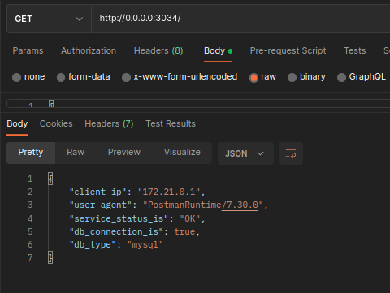

# Customer Service with nodejs+docker 

This is a customer service API Backend application. It is powered by NodeJS and Docker and allows you to use different databases (such as MongoDB, PostgreSQL, or MySQL). Thank you for your contributions.

TODO

- [x] Prepare development environment
- [x] Endpoint routing work with Express
- [x] MongoDB implementation
- [x] Posqresql implementation
- [x] Mysql implementation
- [ ] Write test :)
- [x] Run With Docker-Compose for development environment
- [ ] Run With Docker-Compose for production environment

for sql create table;
``` sql
CREATE TABLE mydatabase.customers (
	id BIGINT NOT NULL,
	CONSTRAINT p_pk PRIMARY KEY (id),
	name varchar(100) NOT NULL,
	email varchar(100) NOT NULL
)
-- remove after for postgresql
ENGINE=MyISAM 
DEFAULT CHARSET=utf8mb4
COLLATE=utf8mb4_general_ci;

ALTER TABLE mydatabase.customers MODIFY COLUMN id bigint auto_increment NOT NULL;
```
## RUN
---------------------
``` bash
cp .env.example .env # end set your correct connection defination
```
Run with npm
``` bash
npm start
```
or docker compsoe
``` bash
docker compose -f development-docker-compose.yml up -d # docker port 3034
```
---------------------

## Success run looks like



## CRUD Operation Success run looks like

